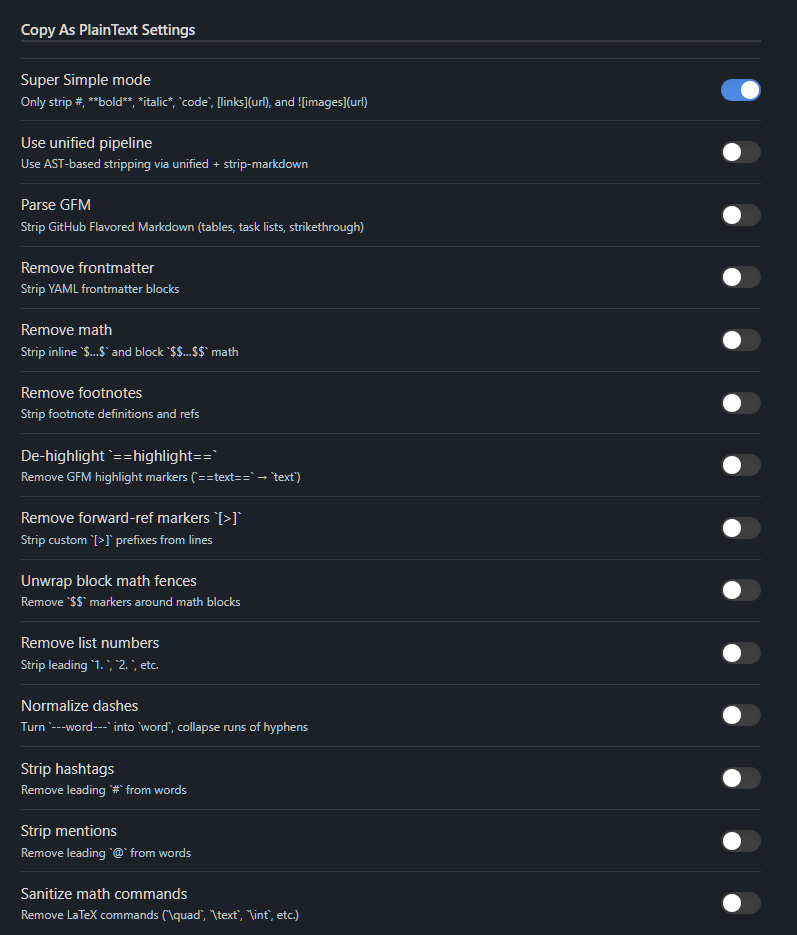
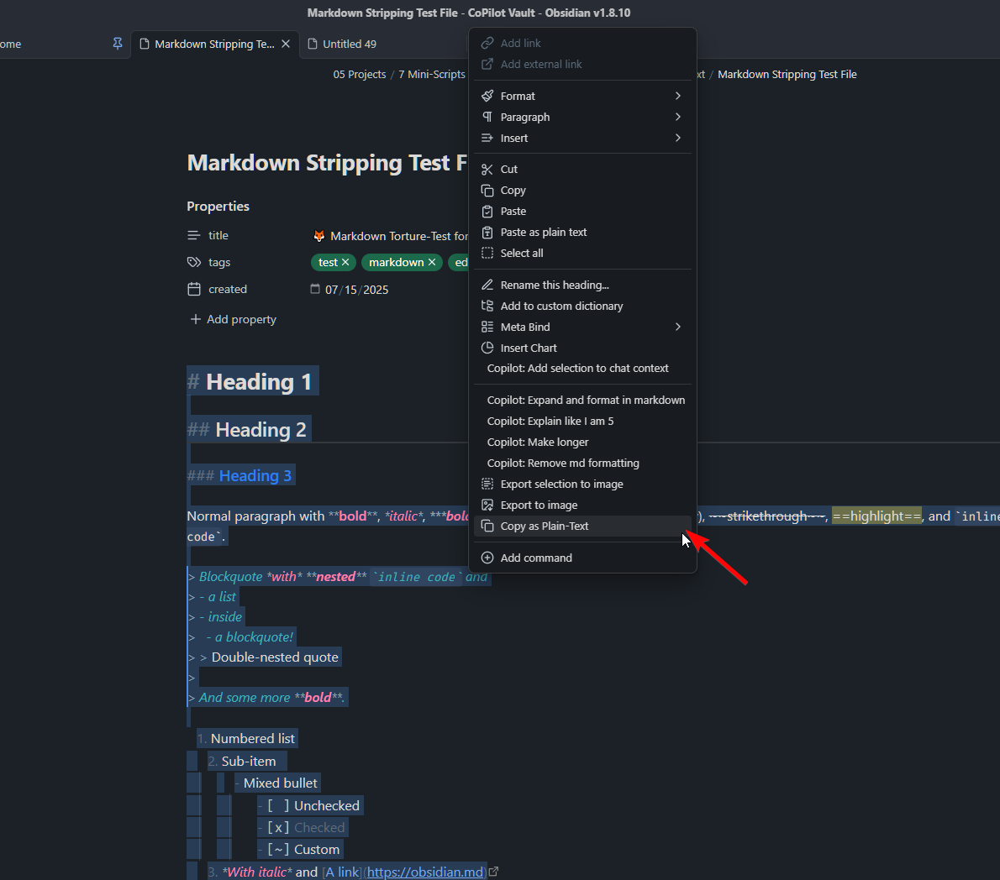

# Copy As PlainText

**Clean, one-click plain-text copy from Obsidian!**

## What it does

- Adds a **“Copy as Plain-Text”** command to:
  - The Command Palette  
  - The editor’s right-click context menu  
- Offers **two stripping modes**:
  1. **Super Simple** (regex-based) — strips common markers like `#`, `**bold**`, `*italic*`, `` `code` ``, `[links](url)`, ``  
  2. **Unified/Remark** (AST-based) — full GFM support (tables, task lists, footnotes, math, frontmatter, HTML blocks)  
- **Fine-tunable settings** let you enable/disable:
  - GFM tables & task lists  
  - YAML frontmatter  
  - Inline and block math  
  - Footnotes & inline refs  
  - Highlight markers (`==text==`)  
  - Custom markers (`[~]`, `[>]`)  
  - List numbers (`1.`, `2.`, …)  
  - Dashes wrapping words (`---word---`)  
  - Hashtags (`#tag`) and mentions (`@user`)  
  - LaTeX commands (`\quad`, `\int`, etc.)  

---

## Installation

### Manual

1. Download the latest ZIP from the [Releases page](https://github.com/FinickySpider/Obsidian-Copy-as-Plaintext/releases)  
2. Extract into your vault’s plugin folder:  
```

<YourVault>/.obsidian/plugins/

```
3. Open Obsidian → **Settings → Community Plugins** → **Reload** or toggle “Copy As PlainText” on.

### Community (coming soon)

- Look for **Copy As PlainText** in Obsidian’s **Community Plugins** browser once accepted.

---

## Usage

1. **Select** the text in any Markdown note.  
2. **Right-click** → **Copy as Plain-Text**, or open the **Command Palette** (Ctrl/Cmd+P) → **Copy as Plain-Text**.  
3. **Paste** anywhere—your selected text will be stripped of Markdown formatting.  
4. Optionally, open **Settings → Plugin Options** to tweak which syntax elements to strip or preserve.

---

## Features

- **Strip basic Markdown**: headings, emphasis, links, images, inline code  
- **Unified AST processing** for robust handling of tables, footnotes, math, HTML blocks  
- **Super Simple mode** for minimal regex stripping—ideal for quick, predictable plain-text  
- **Context menu integration** for one-click copying  
- **Command Palette entry** for keyboard-driven workflow  
- **Customizable**: toggle each stripping step on or off in plugin settings  

---

## Screenshots

### Settings Panel


### Context Menu


---

## Known Issues & Quirks

- **Performance**: AST-based stripping can be slower on very large selections—use Super Simple mode for speed.  
- **Edge-case syntax**: Some niche Markdown plugins or custom syntax may not be recognized by the AST pipeline.  
- **Backslash escapes**: By default, backslash-escaped characters (e.g. `\*`, `\[` ) are unescaped; toggle settings if you need to preserve literal backslashes.  
- **Table layout**: The AST pipeline removes table structure; if you need plain rows or pipes, consider disabling table stripping in settings.

---

## Support & Feedback

- **GitHub Issues**: [Report bugs or request features](https://github.com/FinickySpider/Obsidian-Copy-as-Plaintext/issues)  
- **Contact**: [FinickySpider on GitHub](https://github.com/FinickySpider)  
- **Buy me a coffee**: [Ko-fi](https://ko-fi.com/FinickySpider)  

---

*Built with ❤️ for Obsidian users who just want clean, copy-ready text.*  

